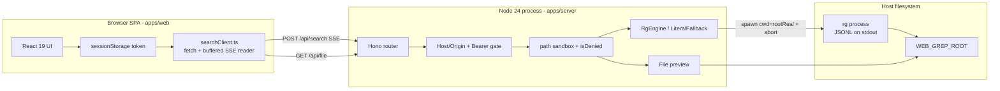
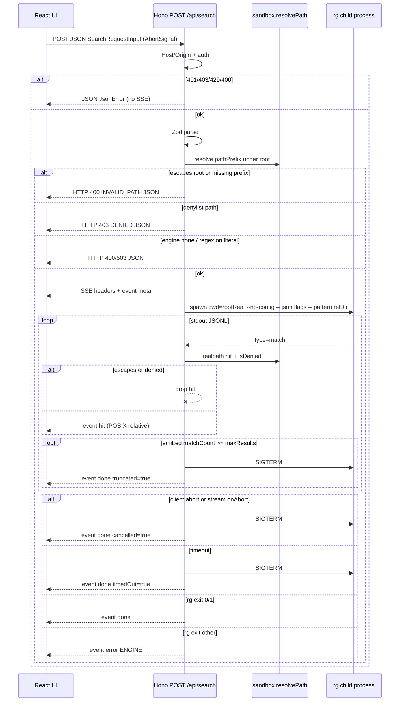
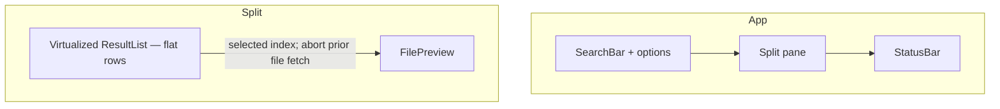
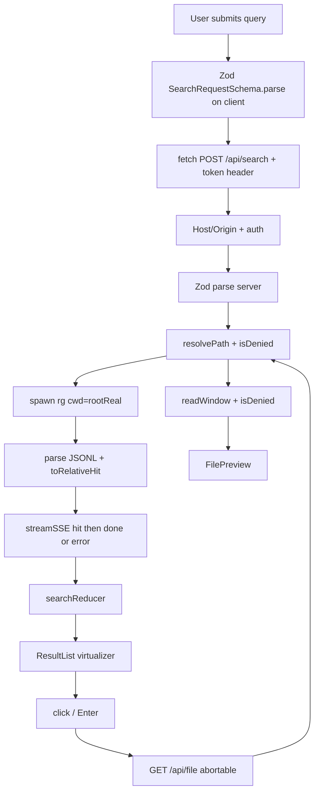

# Web Grep: Self-Hosted Ripgrep in the Browser

| Field | Value |
| --- | --- |
| **Title** | Web Grep — convenient web UI for server-side file search |
| **Author** | TBD |
| **Date** | 2026-09-11 |
| **Status** | Draft (rev 3) |
| **Audience** | Senior engineers implementing v1 |
| **Workspace** | `/Users/fun/code/ts/web-grep` (empty greenfield; confirmed no source, config, or git metadata) |

---

## Overview

Web Grep is a **self-hosted, single-user / small-team developer tool**: a React SPA talks to a local TypeScript server that runs **ripgrep** (`rg`) against a configured filesystem root and streams matches back to the browser.

The product is **not** a multi-tenant SaaS, not a general file browser, and not an in-browser grep over uploaded files. Search always executes on the server. The UI is a dense, keyboard-first grep console: query + filters, a virtualized hit list with highlighted matches, and a click-to-open preview pane around the selected line.

The stack is pinned to current stable releases as of 2026-09-11. **TypeScript is exact `7.0.2`, not `^7`.** Other runtime libraries are exact in `package.json` as well (lockfile is source of truth).

| Layer | Pin | Rationale |
| --- | --- | --- |
| Language | **TypeScript 7.0.2** (exact) | npm `latest` (7.1 is nightly only) |
| UI | **React 19.3.0** + **react-dom 19.3.0** + **Vite 8.3.0** + **@vitejs/plugin-react 6.1.1** | current stable; plugin-react 6 is the Vite 8 companion (Oxc refresh) |
| Runtime | **Node.js ≥ 24.0.0** (`.nvmrc` = `24.21.0`) | native type stripping; Active LTS. 26.8.2 Current also supported |
| Types | **@types/node 24.13.4** | match Node 24. **Do not** add `@types/react` / `@types/react-dom` — React 19.3 ships its own types |
| API | **Hono 4.13.7** + **@hono/node-server 2.1.1** + **@hono/zod-validator 0.9.1** + **Zod 4.6.1** | typed routes, native SSE, Zod 4 |
| Search | **ripgrep** (`rg`); bundled via **@vscode/ripgrep 1.18.0** (optionalDependencies ship platform binaries; no postinstall download) | same engine as VS Code |
| Test | **Vitest 5.0.0** + **@testing-library/react 16.3.3** | Vitest 5 requires Vite ≥ 6.4 and Node ≥ 22.12; works with Vite 8 |
| Lists | **@tanstack/react-virtual 3.14.10** | 10k-hit cap; added in PR 6 |
| Globs | **picomatch 4.0.7** (`{ dot: true }`) | `isDenied` matcher; denies `.env` |
| Lint / format | **oxlint 1.82.0** + **oxlint-tsgolint@7.0.2000** (tracks TS 7.0.2) + **@biomejs/biome 2.5.13** | `typescript-eslint` does **not** support TS 7.0. Biome is **formatter only** (`linter.enabled: false`) |
| Package manager | **pnpm 12.4.0** (`packageManager` field) | current major as of 2026-09-08 |

The whole repo is strict TypeScript (`strict: true`, `noUncheckedIndexedAccess`, `erasableSyntaxOnly`) with **shared Zod contracts** imported by both client and server from `@web-grep/shared`.

---

## Background & Motivation

Command-line `rg` is fast and correct, but inconvenient when:

- The tree lives on a remote or always-on machine and the user is in a browser.
- The user wants click-to-preview, match highlighting, glob filters, and keyboard navigation without leaving a single page.
- Sharing a search UI with a teammate on the same LAN is easier than SSHing — **only** with `WEB_GREP_TOKEN` set and a token prompt in the SPA (see Auth).

Existing options are a poor fit:

- **VS Code / Cursor search** requires an editor session on that machine.
- **Sourcegraph / OpenGrok** are heavy, indexed, and multi-service.
- **In-browser grep** of uploaded zips does not search the *server* filesystem.

This project is a thin, secure wrapper around `rg` plus a purpose-built React UI. The empty workspace at `/Users/fun/code/ts/web-grep` is the intended home; nothing is being retrofitted.

Pain points the design must not reintroduce:

1. **Arbitrary filesystem read** — a grep server is a read primitive. Without a hard search root and path sandbox, it is a data-exfiltration tool.
2. **Blocking JSON search** — large result sets freeze the UI and the HTTP connection. Streaming is required.
3. **Stale in-flight searches** — submitting a new query must cancel the previous `rg` process.
4. **Secret files** — `.env`, keys, and credential JSON must be excluded by default from **both** search and preview.
5. **File-symlink read-through** — `rg` follows *file* symlinks even without `--follow`. Hits and preview must realpath-filter.

---

## Goals & Non-Goals

### Goals (v1)

- Search file **contents** under a single configured root (`WEB_GREP_ROOT`).
- Ripgrep-class options: regex vs literal, case sensitivity, word match, include/exclude globs, optional hidden files.
- Stream hits to the UI as they are found (SSE). First paint of results without waiting for the full scan.
- Result row: relative path, line number, highlighted match. Click opens a preview window around the hit.
- Copy relative path. Keyboard: `⌘/Ctrl-Enter` search, `j`/`k` or arrows move hits, `Enter` preview, `Escape` cancel/close, `/` focus query.
- Explicit empty / loading / error / no-results / truncated states.
- Chinese UI as the default locale; English as the second locale.
- Bind `127.0.0.1` by default. Optional shared bearer token. Refuse to listen on a non-loopback address without a token. SPA can **prompt for and send** that token.
- Caps: max results, wall-clock timeout, preview byte/line limits, binary skip (rg **default**, no `--binary` flag), no directory-symlink follow by default, file-symlink hits dropped after `realpath`.
- Tests: sandbox unit tests (including `path.win32` cases), API contract tests, a small set of UI tests for the search flow.

### Non-Goals (v1)

- Multi-tenant SaaS, accounts, OAuth, SSO, per-user roots.
- Write operations (edit, replace, delete). This is read-only.
- Full indexed search (trigram index, Sourcegraph clone). `rg` is brute-force and that is acceptable for a personal/internal tree.
- Git blame, symbol search, or language-aware AST search.
- Multi-root workspaces or browsing the filesystem as a tree (a path prefix filter is enough).
- Mobile-first layout (usable, not optimized).
- Windows as a *first-class* CI target. Code must be path-safe (`node:path` + POSIX display paths) but v1 CI is macOS/Linux. **Unit tests still cover `path.win32` logic.**
- Serving files for download, or exposing absolute server paths to the client.
- Custom ignore-file language beyond what `rg` already honors (`.gitignore`, `.ignore`, `.rgignore`). Literal fallback does **not** emulate ignore files.
- Query-history dropdown (v1.1).
- Light theme, language-type chips (`rg --type`), Dockerfile (README-only in v1).
- Prometheus / `metrics.ts` (v1 is log-only).

---

## Key Decisions

| Decision | Choice | Rationale |
| --- | --- | --- |
| Product shape | Self-hosted single-process tool, not SaaS | The request is “grep server files from a webpage.” Multi-tenant multiplies auth, isolation, and abuse surface for no v1 value. |
| Layout | pnpm workspace: `apps/web`, `apps/server`, `packages/shared` | Shared Zod contracts without publishing; Vite and Node stay independently runnable. All three packages `"type": "module"`. |
| TypeScript | **7.0.2 exact** (not 7.1 nightlies, not `^7`) | npm `latest` as of 2026-09-11. |
| TS 7.0 Compiler API gap | Do **not** use `typescript-eslint`, `ts-morph`, `ts-jest`, `ts-node` | TS 7.0 dropped the programmatic compiler API (deferred to 7.1). `typescript-eslint` throws on `versionMajor >= 7`. |
| Lint vs format | Oxlint + `oxlint-tsgolint@7.0.2000` for lint; Biome format only | tsgolint patch track is `7.0.2xxx`. Biome `linter.enabled: false` so CI does not fight Oxlint. |
| Node | `engines.node: ">=24.0.0"`; `.nvmrc` `24.21.0` | Type stripping is unflagged. |
| Server TS execution | Dev: Node runs `.ts` directly. Prod: `tsc -b` emit to `dist/` | Avoids `tsx`. `erasableSyntaxOnly` keeps syntax Node can strip. Shared package is compiled to `dist/` and consumed via package `exports`. |
| UI toolchain | Vite 8.3 + React 19.3 + plugin-react 6.1.1 | Fast HMR, Rolldown production build, no Next.js (no SSR need). |
| HTTP framework | Hono 4.13 on `@hono/node-server` 2.1.1 | First-class TypeScript, native `streamSSE`, Zod middleware, abort-signal fixes in v2. |
| Search transport | **SSE** over `POST /api/search` | One-way server→client hit stream; cancel via `AbortController`. Not Hono RPC (`hc`) — SSE events are not request/response RPC. |
| SSE lifecycle | Pre-stream failures are HTTP JSON; every opened SSE stream ends with exactly one `done` **or** one `error` | See protocol section. Timeout is `done.timedOut=true`, not `event: error`. |
| Search engine | `rg` required for regex. Resolution: `WEB_GREP_RG` → `PATH` walk → `@vscode/ripgrep`. Literal JS walker is last-resort, **not equivalent** | `@vscode/ripgrep` ships platform binaries in optionalDependencies (no postinstall download). Literal mode ignores gitignore and rejects regex. |
| Auth | Loopback bind + optional `WEB_GREP_TOKEN` + **sessionStorage token prompt** | Non-loopback listen **requires** the token **and** `WEB_GREP_PUBLIC_HOST` (hard fail on boot). Browser sends `X-Web-Grep-Token` from `sessionStorage`. No cookies, no query-string token, no HTML injection. |
| DNS rebinding | Split Host/Origin policy: loopback names on the listen port; LAN/TLS via `WEB_GREP_PUBLIC_HOST`. Never treat `0.0.0.0` as a Host. **No CORS middleware.** | Vite `Host: *:5173` is allowed only in development. See Bind + auth. |
| Path model | Client never sees absolute paths | Spawn `rg` with `cwd: rootReal` and a **relative** search path. Every hit is re-resolved; absolute/`..` paths are dropped. |
| File symlinks | `realpath` each hit and preview path; drop escapes | `--follow` only controls *directory* traversal. File symlinks are grepped by `rg` unless we filter. |
| Denylist | Shared `isDenied(relPosix)` for `rg` globs, literal walk, **and** `GET /api/file` | Search-only denylist is a read oracle via preview. Server exclude globs are **last** on the argv (ripgrep last-match-wins). |
| i18n | zh-CN default, en-US second, typed message catalogs | The original request is in Chinese. No i18next. |
| State | React 19 local state + `useReducer`; no Redux | One screen. Streaming hits live in a reducer. |
| Lists | `@tanstack/react-virtual` **3.14.10**, **flat rows** (path on every row). No sticky file headers | Sticky headers in a windowed list desync `j`/`k`. |
| Query history | **v1.1**, not v1 | Keep the reducer simple. |
| Package manager | **pnpm 12.4.0** (`packageManager: "pnpm@12.4.0"`) | Current major; workspace protocol `workspace:*`. |

---

## Proposed Design

### System architecture



One Node process serves:

1. `/api/*` — JSON + SSE. **All `/api` routes are registered before any SPA fallback.**
2. In production, the Vite-built SPA from `apps/web/dist` as static files (`GET /*` **after** `/api/*`).
3. In development, Vite (port 5173) proxies `/api` to Hono (port 8787) with **disabled proxy timeouts**.

### Repository layout (committed after implementation)

```
web-grep/
  package.json                 # private workspace root, scripts, engines, packageManager
  pnpm-workspace.yaml          # packages: apps/*, packages/*
  pnpm-lock.yaml
  tsconfig.base.json
  tsconfig.json                # solution-style project references
  vitest.config.ts             # workspace test root (or per-package)
  biome.json                   # formatter only; linter.enabled: false
  .oxlintrc.json
  .gitignore
  .nvmrc                       # 24.21.0
  .env.example
  README.md
  apps/
    web/
      package.json             # "type": "module"
      tsconfig.json
      tsconfig.app.json
      vite.config.ts
      index.html
      src/
        main.tsx
        App.tsx
        styles.css
        i18n/
          index.ts
          zh-CN.ts
          en-US.ts
        api/
          headers.ts           # auth header from sessionStorage
          readSse.ts
          searchClient.ts      # import from @web-grep/shared
          fileClient.ts
        state/
          searchReducer.ts
        components/
          SearchBar.tsx
          SearchOptions.tsx
          ResultList.tsx
          ResultRow.tsx
          FilePreview.tsx
          StatusBar.tsx
          EmptyState.tsx
          TokenPrompt.tsx
        hooks/
          useSearch.ts
          useHotkeys.ts
          useLocale.ts
          useToken.ts
        test/
          search-flow.test.tsx
    server/
      package.json             # "type": "module"
      tsconfig.json
      src/
        index.ts               # boot, bind policy, signal handlers
        app.ts                 # Hono app factory; API routes before static
        config.ts
        auth.ts                # token + Host/Origin
        log.ts
        routes/
          search.ts
          file.ts
          meta.ts
          health.ts
        sandbox/
          resolvePath.ts
          denylist.ts          # isDenied + toRgGlobs
        search/
          types.ts
          rgEngine.ts
          literalFallback.ts
          spawnRg.ts
          parseRgJson.ts
          toRelativeHit.ts     # realpath + deny + relative
        preview/
          readWindow.ts
      test/
        sandbox.test.ts
        denylist.test.ts
        search-contract.test.ts
        auth.test.ts
        win32-paths.test.ts
  packages/
    shared/
      package.json             # name @web-grep/shared, "type": "module"
      tsconfig.json            # composite, outDir dist
      src/
        index.ts
        limits.ts
        searchRequest.ts
        searchEvents.ts
        file.ts
        meta.ts
        errors.ts
        globs.ts
      test/
        schemas.test.ts
```

`packages/shared` exports **only Zod schemas, inferred types, and numeric limits**. No Node or DOM imports.

### Package graph and `"type": "module"`

Every package.json includes `"type": "module"`.

`packages/shared/package.json`:

```json
{
  "name": "@web-grep/shared",
  "private": true,
  "type": "module",
  "exports": {
    ".": {
      "types": "./dist/index.d.ts",
      "import": "./dist/index.js"
    }
  },
  "scripts": {
    "build": "tsc -b",
    "dev": "tsc -b --watch",
    "test": "vitest run"
  }
}
```

`apps/web` and `apps/server` depend on `"@web-grep/shared": "workspace:*"`. Root `predev` **builds** shared once so `dist/` exists before watchers start; then `dev` runs `tsc -b --watch` for shared in parallel with Vite and `node --watch` on the server. Vite must `optimizeDeps.exclude: ["@web-grep/shared"]` so it does not cache a stale prebundle of `dist/`.

Project references:

```
tsconfig.json (solution)
  → packages/shared
  → apps/server (references shared)
  → apps/web (references shared; module/moduleResolution: bundler)
```

Client import (the only allowed contract import path):

```ts
import {
  SearchRequestSchema,
  type SearchRequestInput,
  type SseEvent,
} from "@web-grep/shared";
```

### TypeScript configuration (all packages)

`tsconfig.base.json`:

```jsonc
{
  "compilerOptions": {
    "target": "ES2024",
    "lib": ["ES2024"],
    "module": "NodeNext",
    "moduleResolution": "NodeNext",
    "strict": true,
    "noImplicitAny": true,
    "noUncheckedIndexedAccess": true,
    "noImplicitOverride": true,
    "exactOptionalPropertyTypes": true,
    "verbatimModuleSyntax": true,
    "erasableSyntaxOnly": true,
    "isolatedModules": true,
    "skipLibCheck": true,
    "forceConsistentCasingInFileNames": true
  }
}
```

`apps/web` overrides `lib` to `["ES2024", "DOM", "DOM.Iterable"]`, `module`/`moduleResolution` to `bundler`, `jsx` to `react-jsx`, `noEmit` true.

**Banned syntax** (enforced by `erasableSyntaxOnly`): `enum`, `namespace`, parameter properties, `import =`. Use `as const` objects instead of enums.

Biome (`biome.json`): `"linter": { "enabled": false }`, formatter on. Oxlint owns lint, including type-aware via `oxlint-tsgolint@7.0.2000`.

### Runtime and boot

`apps/server/src/index.ts`:

1. Parse env via Zod (`config.ts`). **Refuse to start** if `WEB_GREP_ROOT` is missing, not a directory, or not readable. `realpath` it once → `rootReal`.
2. Apply bind policy (see Security). Non-loopback without token → **throw**.
3. Detect engine (see below). Missing `rg` before bundled/literal PRs: boot succeeds, `engine: "none"`.
4. `serve({ fetch: app.fetch, hostname, port })` from `@hono/node-server`.
5. On `SIGTERM`/`SIGINT`: abort all in-flight `rg` child processes, then `close()`.

Dev script (root):

```json
{
  "packageManager": "pnpm@12.4.0",
  "engines": { "node": ">=24.0.0" },
  "scripts": {
    "predev": "pnpm --filter @web-grep/shared build",
    "dev": "pnpm run --parallel dev:shared dev:server dev:web",
    "dev:shared": "pnpm --filter @web-grep/shared dev",
    "dev:server": "pnpm --filter @web-grep/server dev",
    "dev:web": "pnpm --filter @web-grep/web dev",
    "typecheck": "tsc -b",
    "test": "vitest run",
    "lint": "oxlint --type-aware --type-check",
    "format": "biome check --write ."
  }
}
```

Server `dev`: `node --watch src/index.ts` (Node 24 type stripping).  
Server `start` (prod): `node dist/index.js` after `tsc -b --force`.

### Shared contracts (`packages/shared`)

`limits.ts` is the single source of numeric caps. Zod schemas **import** these constants — never re-hardcode.

```ts
export const LIMITS = {
  queryMaxChars: 512,
  pathMaxChars: 4096,
  globMaxChars: 256,
  globMaxCount: 32,
  maxResultsDefault: 10_000,
  maxResultsHard: 50_000,
  timeoutMsDefault: 30_000,
  previewBytes: 1_048_576,
  previewLines: 201,
  beforeAfterDefault: 20,
  beforeAfterMax: 100,
  lineTextMaxChars: 2048,
  maxFilesizeRg: "8M",
  heartbeatMs: 5_000,
  perFileMaxCount: 100,
} as const;
```

Zod 4 + `exactOptionalPropertyTypes`: **input vs output**. Fields with `.default()` are optional on the wire and required after parse.

```ts
import * as z from "zod";
import { LIMITS } from "./limits.ts";

export const SearchRequestSchema = z.object({
  query: z.string().min(1).max(LIMITS.queryMaxChars),
  path: z.string().max(LIMITS.pathMaxChars).default(""),
  globInclude: z.array(z.string().max(LIMITS.globMaxChars)).max(LIMITS.globMaxCount).default([]),
  globExclude: z.array(z.string().max(LIMITS.globMaxChars)).max(LIMITS.globMaxCount).default([]),
  regex: z.boolean().default(true),
  caseSensitive: z.boolean().default(true),
  wordMatch: z.boolean().default(false),
  hidden: z.boolean().default(false),
  maxResults: z.number().int().positive().max(LIMITS.maxResultsHard).optional(),
});
export type SearchRequestInput = z.input<typeof SearchRequestSchema>;
export type SearchRequest = z.output<typeof SearchRequestSchema>;
```

The client sends `SearchRequestInput` (construct with whatever the form has). The server parses with `SearchRequestSchema` and uses `SearchRequest` (`z.output`). The client **does** parse with the same schema before `fetch` so bad UI state never hits the network; `z.input` is the form-state type.

SSE payloads are untagged JSON; the discriminator is the SSE `event:` field. Shared union:

```ts
export const SseMetaSchema = z.object({
  searchId: z.string().uuid(),
  engine: z.enum(["rg", "literal"]),
});
export const SseHitSchema = z.object({
  path: z.string(), // POSIX relative, never absolute
  line: z.number().int().positive(),
  text: z.string(),
  matches: z.array(z.object({
    start: z.number().int().nonnegative(),
    end: z.number().int().nonnegative(),
  })),
});
export const SseDoneSchema = z.object({
  elapsedMs: z.number(),
  matchCount: z.number().int().nonnegative(),
  fileCount: z.number().int().nonnegative(),
  truncated: z.boolean(),
  timedOut: z.boolean(),
  cancelled: z.boolean(),
});
export const ErrorCodeSchema = z.enum([
  "INVALID_QUERY",
  "INVALID_PATH",
  "INVALID_GLOB",
  "DENIED",
  "BUSY",
  "ENGINE",
  "ENGINE_UNSUPPORTED",
  "UNAUTHORIZED",
  "FORBIDDEN_HOST",
  "INTERNAL",
]);
export const JsonErrorSchema = z.object({
  code: ErrorCodeSchema,
  message: z.string(),
});
export const SseErrorSchema = JsonErrorSchema;

export type SseEvent =
  | { event: "meta"; data: z.output<typeof SseMetaSchema> }
  | { event: "hit"; data: z.output<typeof SseHitSchema> }
  | { event: "done"; data: z.output<typeof SseDoneSchema> }
  | { event: "error"; data: z.output<typeof SseErrorSchema> };
```

`TIMEOUT` is **not** an error code. A wall-clock timeout is a successful stream termination: `event: done` with `timedOut: true`.

Also export `MetaResponseSchema`, `FileQuerySchema`, `FileWindowResponseSchema` (see HTTP API).

`searchId` is `crypto.randomUUID()` (UUID v4), not ULID.

### Search engine



#### Detecting `rg`

`spawnRg.ts` resolution order (no shell, no `which`/`where`):

1. `WEB_GREP_RG` if set — must be an absolute path, `fs.access` X_OK.
2. Walk `process.env.PATH` split by `path.delimiter`; first `rg` / `rg.exe` that is executable.
3. `@vscode/ripgrep` `rgPath` if the optional native package resolved for this platform.
4. Else `engine: "none"` until literal fallback exists; then `engine: "literal"`.

`@vscode/ripgrep` ships per-platform binaries as **optionalDependencies** inside the published tarball. There is **no postinstall network fetch**. Air-gapped installs work when the optional package for the host arch is present; exotic arch falls through to `WEB_GREP_RG` or literal. Pin the exact `@vscode/ripgrep` version in the lockfile at the PR that adds it.

On boot, `GET /api/meta` reports `{ engine: "rg" | "literal" | "none", rgVersion, rootLabel, limits }`. The UI shows a banner if `engine !== "rg"`.

Regex + `engine === "literal"` → **HTTP 400** `ENGINE_UNSUPPORTED` (before SSE).  
`engine === "none"` → **HTTP 503** `ENGINE` (before SSE).

#### `rg` argv (this block is the source of truth)

Spawn **without a shell**: `spawn(rgBin, argv, { cwd: rootReal, env: rgEnv, stdio: ["ignore", "pipe", "pipe"] })`.

`rgEnv` is a tight allowlist, **not** `process.env`:

```
PATH: process.env.PATH  (so dynamic linker / locale helpers still work)
LANG: process.env.LANG ?? "C.UTF-8"
LC_ALL: process.env.LC_ALL ?? "C.UTF-8"
HOME: omitted
RIPGREP_CONFIG_PATH: omitted (never inherited)
TERM: omitted
```

Always pass **`--no-config`** so a developer’s `RIPGREP_CONFIG_PATH` / `rgconfig` cannot inject `--follow`, `--hidden`, `--no-ignore`, or `--binary`.

```
rg
  --no-config
  --json
  --line-number
  --with-filename
  --no-heading
  --glob '!.git/**'
  --max-columns 2048
  --max-columns-preview
  --max-filesize 8M
  --threads <WEB_GREP_THREADS or 0>
  --max-count <per-file cap, default 100>
  -F                      # if request.regex === false
  -s or -i                # case
  -w                      # if wordMatch
  --hidden                # if hidden
  --glob <userInclude>…   # sanitized; never starts with !
  --glob !<userExclude>…  # sanitized
  --glob !<serverDenylist>…   # ALWAYS LAST among globs (last-match-wins)
  --glob '.env.example'   # server allow-exception, after denylist
  --
  <pattern>
  <relativeDir>           # "." or sandboxed relative prefix; NEVER absolute
```

Do **not** pass `--binary` or `-a`/`--text`. Recursive `rg` **skips** binary (NUL) files by default. `--binary` *enables* binary search and would dump binary-ish content into SSE.

Do **not** pass `--color`; `--json` is already machine output.

Do **not** pass a second `--`. After the first `--`, every token is positional; a second `--` is a path named `--`.

`--` before `<pattern> <relativeDir>` is what stops a pattern of `-n` / `--json` from being a flag. Contract test: query `-n` and query `--json`.

Never pass `--no-ignore-vcs` unless `WEB_GREP_NO_IGNORE=1`. Never `--follow` unless `WEB_GREP_FOLLOW_SYMLINKS=1`. **`--follow` only follows directory symlinks.** File symlinks whose names live under the root are still read by `rg`; that is handled in `toRelativeHit`, not by omitting `--follow`.

#### Hit post-process (`toRelativeHit.ts`) — required on every `match`

`rg --json` `data.path.text` is relative to `cwd` **if** we passed a relative search path. We still never forward it verbatim:

1. Interpret the path as relative to `rootReal` (if `rg` emits absolute — e.g. a bug or `WEB_GREP_FOLLOW_SYMLINKS` — reject).
2. `resolveUnderRoot(rootReal, rel)` including `realpath` of the file. If it escapes → **drop the hit** (do not error the stream).
3. `isDenied(relPosix)` → drop.
4. Convert submatch **byte** offsets to UTF-16 indexes; clamp line text.
5. Emit `SseHit` with POSIX relative `path` only.

Literal walker: `realpath` + `isDenied` **before** reading file bytes. Same drop rules.

Contract tests use the sandbox fixture `link-out` → outside: searching the root must yield **zero hits** from that symlink, even when the target contains the needle.

#### Parsing `rg --json`

Each stdout line is one JSON object.

| `type` | Action |
| --- | --- |
| `begin` | ignore (or count files opened) |
| `match` | `toRelativeHit`; if ok, write SSE `hit` |
| `context` | ignore in v1 (preview fetches its own window) |
| `end` | ignore |
| `summary` | use stats if present |

`submatches[].start` / `end` are **byte offsets**. Convert to UTF-16 code units before sending. Invalid UTF-8 → no submatch highlight rather than crash. Clamp line text to `LIMITS.lineTextMaxChars`.

#### Process lifecycle and cancellation

- `spawn` without `detached`. `rg` threads are in-process, so `child.kill("SIGTERM")` is sufficient; if still alive after 1s, `SIGKILL`.
- Abort sources, combined with `AbortSignal.any`:
  1. `c.req.raw.signal` (client `fetch` abort / TCP reset).
  2. `stream.onAbort` from Hono `streamSSE` (proxy drop that might not surface on `raw.signal`).
  3. `AbortSignal.timeout(config.searchTimeoutMs)`.
- Both (1) and (2) must SIGTERM `rg`. Contract test: abort inflight → `inflight` count returns to 0.
- Timeout → SIGTERM → SSE `event: done` `{ timedOut: true, cancelled: false, truncated: false }`. Do **not** also send `event: error`.
- Client abort / `onAbort` → try to send `event: done` `{ cancelled: true }` if the writable is still open; then close. If the client already hung up, just kill `rg`.
- After `event: error` or `event: done`: close the SSE stream. No further events.
- Heartbeat: every `LIMITS.heartbeatMs` (5s) write an SSE comment `: ping\n\n` so Vite/nginx idle timeouts do not kill a long scan with no hits.
- Global concurrency: max **2** simultaneous searches. Check **before** SSE headers. A third request is **HTTP 429** JSON `{ code: "BUSY" }` — never SSE `BUSY`.
- `searchId = crypto.randomUUID()`. Registry `Map<string, ChildProcess>`.
- **Truncation and counters count only emitted hits.** Increment `matchCount` after `toRelativeHit` succeeds and the SSE `hit` is written — never on raw `rg` `match` lines that are later dropped (denied, symlink escape, absolute path). Truncate when **emitted** `matchCount >= maxResults`. `fileCount` is the number of unique emitted POSIX relative paths (not rg’s `searches_with_match`). `done.matchCount` / `done.fileCount` must equal what the UI received.

#### Literal fallback (no `rg`) — last resort, not equivalent

Walk with `fs.promises.opendir` (iterative). For each dirent:

- Directories: skip if `isDenied(rel)` or name `.git`; do not follow dir symlinks (`dirent.isSymbolicLink()` + `isDirectory` via `lstat`, skip). Depth cap 32.
- Files: `isDenied(rel)` skip; size > max skip; `realpath` must stay under root; first 8KiB NUL → skip; else read and `includes` (case-fold via `toLocaleLowerCase("en")` if insensitive). **No regex.**

**Semantic gap vs `rg` (must be in the UI banner, not only README):**

- Does **not** honor `.gitignore` / `.ignore` / `.rgignore`.
- Depth 32 vs unlimited `rg`.
- Unicode case-folding is not rg’s.
- Regex mode is refused (`ENGINE_UNSUPPORTED`).

Banner copy (`literalEngineBanner`):  
zh-CN: `未找到 ripgrep，已降级为字面量搜索（不读取 gitignore，不支持正则）`  
en-US: `ripgrep not found; using literal search (no gitignore, no regex)`

v1 still **prefers** shipping `@vscode/ripgrep` so most machines never see this path. We keep the walker so a laptop without a native binary can still do literal search; we do **not** claim feature parity.

### HTTP API

All JSON request/response bodies are Zod-validated. Shared schemas live in `packages/shared`.

#### Protocol rule (canonical)

| When | How it fails / ends |
| --- | --- |
| Auth, Host/Origin, Zod, busy, path sandbox, denylist, engine missing, regex-on-literal | **HTTP 4xx/503 + `JsonError` body. No SSE headers.** |
| SSE stream has started | Heartbeats (`: ping`) allowed. Terminal event is **exactly one** of `done` or `error`. Then close. |
| Timeout | `done.timedOut = true` |
| Client/proxy abort | `done.cancelled = true` if writable; always SIGTERM `rg` |
| `rg` crash | `event: error` `ENGINE`, then close |
| Truncation | `done.truncated = true` (not an error) |

The UI on `event: error` **keeps already-rendered hits** and shows the error in the status bar. On HTTP error before any stream, hits stay as they were (previous search) or empty if this was the first.

#### `GET /api/health`

No auth.

```json
{ "ok": true, "engine": "rg" }
```

`engine` is `"rg" | "literal" | "none"`. Does **not** include `rootLabel` or the absolute root. Unhelpful for “did the root vanish”; boot already refused a missing root. If the root is deleted after boot, the next search returns `INVALID_PATH`.

#### `GET /api/meta` (auth)

```ts
export const MetaResponseSchema = z.object({
  engine: z.enum(["rg", "literal", "none"]),
  rgVersion: z.string().nullable(),
  rootLabel: z.string(),
  followSymlinks: z.boolean(),
  limits: z.object({
    maxResults: z.number(),
    maxResultsHard: z.number(),
    timeoutMs: z.number(),
    previewBytes: z.number(),
    previewLines: z.number(),
    queryMaxChars: z.number(),
  }),
  defaultLocale: z.literal("zh-CN"),
  authRequired: z.boolean(),
});
```

`authRequired` lets the SPA know it must prompt for a token (LAN mode) without treating a 401 as a surprise.

#### `POST /api/search` (auth) → `text/event-stream` or JSON error

Body: `SearchRequestSchema`.

SSE headers: `Content-Type: text/event-stream`, `Cache-Control: no-cache, no-transform`, `X-Accel-Buffering: no`, `Connection: keep-alive`.

Wire format:

```
event: meta
data: {"searchId":"550e8400-e29b-41d4-a716-446655440000","engine":"rg"}

event: hit
data: {"path":"apps/server/src/app.ts","line":42,"text":"app.post(\"/api/search\", ...)","matches":[{"start":9,"end":21}]}

: ping

event: done
data: {"elapsedMs":180,"matchCount":12,"fileCount":4,"truncated":false,"timedOut":false,"cancelled":false}
```

**Why SSE not chunked JSON array:** the client can render each hit immediately; mid-stream abort is a normal TCP close. We use `fetch` + `ReadableStream` (not `EventSource`) because we need **POST + JSON body + token header**.

#### `GET /api/file` (auth)

Query parsed with `FileQuerySchema`: `path` (required), `line` (required, 1-based), `before` / `after` (default 20, max 100).

**Must** run `resolveUnderRoot` **and** `isDenied(rel)`. Denied → HTTP 403 `{ code: "DENIED" }`. Missing → 404 `{ code: "INVALID_PATH" }`.

Response `FileWindowResponseSchema`:

```ts
{
  path: string;            // POSIX relative
  startLine: number;
  lineCount: number;
  truncated: boolean;
  binary: boolean;         // if true, lines is []
  lines: Array<{ n: number; text: string }>;
}
```

Implementation (`readWindow.ts`):

1. Sandbox-resolve `path` (missing file → 404).
2. `isDenied` → 403.
3. `open` + `fstat` on the fd (reduce TOCTOU): reject if not a file, if size > `previewBytes`, if directory.
4. `realpath` of that fd’s path must stay under root.
5. Read; NUL in first 8 KiB → `{ binary: true, lines: [] }`.
6. Decode UTF-8 (lossy); window around `line`; each line clamped to 2048 chars.

Do **not** return the whole file. Do **not** support `Range` downloads.

#### Hono route sketch (`apps/server/src/app.ts`)

Hono applies `app.use` only to **subsequently** registered matching routes. Register `hostOriginMiddleware` **before any `/api` route** (including health). Register `authMiddleware` **after** health so health stays public.

`@hono/zod-validator`’s default 400 body is a Zod issue list, not `JsonError`. Use a hook:

```ts
import { zValidator } from "@hono/zod-validator";
import type { ValidationTargets } from "hono";
import type * as z from "zod";

function jsonErrorValidator<T extends z.ZodType, K extends keyof ValidationTargets>(
  target: K,
  schema: T,
) {
  return zValidator(target, schema, (result, c) => {
    if (!result.success) {
      const message = result.error.issues[0]?.message ?? "invalid request";
      return c.json({ code: "INVALID_QUERY" as const, message }, 400);
    }
  });
}
```

```ts
import { Hono } from "hono";
import { streamSSE } from "hono/streaming";
import { SearchRequestSchema, FileQuerySchema } from "@web-grep/shared";

export function createApp(deps: AppDeps) {
  const app = new Hono();
  app.use("/api/*", hostOriginMiddleware(deps.config)); // includes health
  app.get("/api/health", (c) => c.json({ ok: true, engine: deps.engine }));
  app.use("/api/*", authMiddleware(deps.config)); // no-ops if token unset; does not wrap health
  app.get("/api/meta", (c) => c.json(deps.meta()));
  app.post("/api/search", jsonErrorValidator("json", SearchRequestSchema), async (c) => {
    const req = c.req.valid("json");
    const pre = await deps.search.preflight(req); // busy, path, engine, deny
    if (pre.error) return c.json(pre.error, pre.status);
    return streamSSE(c, async (stream) => {
      const onAbort = () => deps.search.cancel(pre.searchId);
      stream.onAbort(onAbort);
      try {
        await deps.search.run(pre, stream, c.req.raw.signal);
      } finally {
        /* run() always sends done|error if writable */
      }
    });
  });
  app.get("/api/file", jsonErrorValidator("query", FileQuerySchema), fileHandler(deps));
  // Prod only, AFTER /api/* :
  // app.get("/*", serveStatic({ root: webDist }));
  return app;
}
```

Contract test: `POST /api/search` with `{ query: "" }` → HTTP 400 `{ code: "INVALID_QUERY", message }` (not a Zod issue array).

### Frontend design

#### Information architecture



- **Top:** query input (always focused on load), path prefix, include glob, exclude glob, toggles (正则 / 字面量, 大小写, 整词, 隐藏文件), primary button `搜索`. Token prompt modal if 401 / `authRequired`.
- **Center left (~45%):** virtualized **flat** list. Every row shows `path:line` plus the line text. **No sticky file headers** (windowed sticky headers desync selected index).
- **Center right:** preview with the match line highlighted; line numbers; copy-path button.
- **Bottom status:** `12 条结果 · 4 个文件 · 180 ms` or `已截断至 10 000 条` / `已取消` / `超时`.

Empty / loading / error / no-results / truncated are first-class views in `EmptyState.tsx`.

#### Token UX (LAN mode)

`apps/web/src/hooks/useToken.ts` + `api/headers.ts`:

1. Read `sessionStorage["web-grep.token"]` (never `localStorage`, never the URL).
2. Every `fetch` to `/api/*` except `/api/health` sets `X-Web-Grep-Token: <token>` when non-empty. Also `Authorization: Bearer <token>` so operators curling with Bearer still match the same middleware.
3. If `GET /api/meta` returns 401 **or** `authRequired: true` with empty token, show `TokenPrompt` (password-style input). On submit, write sessionStorage and retry. HTTP 403 `FORBIDDEN_HOST` is **not** a token prompt — show a config error (“Host not allowed; set WEB_GREP_PUBLIC_HOST”).
4. Clear on tab close (sessionStorage). No “remember me”.

This is the **only** v1 way the SPA sends `WEB_GREP_TOKEN`. Do not inject the token into `index.html`. Reverse-proxy basic-auth is an *additional* operator option, not a substitute for the prompt when the Node process itself requires the token.

#### UI copy (zh-CN default)

| Key | zh-CN | en-US |
| --- | --- | --- |
| `queryPlaceholder` | 搜索文件内容（正则） | Search file contents (regex) |
| `search` | 搜索 | Search |
| `cancel` | 取消 | Cancel |
| `path` | 路径前缀 | Path prefix |
| `include` | 包含 glob | Include glob |
| `exclude` | 排除 glob | Exclude glob |
| `regex` | 正则 | Regex |
| `literal` | 字面量 | Literal |
| `caseSensitive` | 区分大小写 | Case sensitive |
| `wordMatch` | 整词 | Whole word |
| `hidden` | 隐藏文件 | Hidden files |
| `emptyHint` | 输入查询并按 ⌘⏎ 搜索 | Enter a query and press ⌘⏎ to search |
| `noResults` | 没有匹配 | No matches |
| `truncated` | 结果已截断 | Results truncated |
| `copyPath` | 复制路径 | Copy path |
| `tokenPrompt` | 输入访问令牌 | Enter access token |
| `literalEngineBanner` | 未找到 ripgrep，已降级为字面量搜索（不读取 gitignore，不支持正则） | ripgrep not found; using literal search (no gitignore, no regex) |

Locale is stored in `localStorage` key `web-grep.locale`, default `zh-CN`. A small `中 / EN` toggle lives in the status bar. Catalogs are `satisfies Record<MsgKey, string>`.

#### Client search flow (`useSearch.ts` + `readSse.ts`)

```ts
import {
  SearchRequestSchema,
  type SearchRequestInput,
  type SseEvent,
} from "@web-grep/shared";
import { apiHeaders } from "./headers.ts";

export async function* readSse(
  stream: ReadableStream<Uint8Array>,
  signal: AbortSignal,
): AsyncGenerator<SseEvent> {
  // Buffer Uint8Array chunks until "\n\n".
  // Decode UTF-8 with TextDecoder({ stream: true }).
  // Ignore lines starting with ":" (heartbeats / comments).
  // Parse "event:" + "data:" frames. JSON.parse data; validate with the
  // per-event Zod schema. Skip malformed frames (log once).
  // If the stream closes with neither done nor error, the caller treats
  // that as a transport error (not cancelled unless signal.aborted).
}

export async function* streamSearch(
  input: SearchRequestInput,
  signal: AbortSignal,
): AsyncGenerator<SseEvent> {
  const body = SearchRequestSchema.parse(input); // apply defaults
  const res = await fetch("/api/search", {
    method: "POST",
    headers: { "content-type": "application/json", ...apiHeaders() },
    body: JSON.stringify(body),
    signal,
  });
  if (!res.ok) throw await readJsonError(res);
  if (!res.body) throw new Error("empty body");
  yield* readSse(res.body, signal);
}
```

`useSearch`: cancel previous `AbortController` on new submit (not on every keystroke). No debounce-submit; only button / `⌘/Ctrl-Enter`.

Reducer states: `idle | running | done | cancelled | error`. Hits append-only until `search/start` resets. If `error` arrives after some `hit`s, keep the hits.

If the generator returns without `done`/`error` and `signal.aborted` → `cancelled`. Else → `error` `INTERNAL`.

#### Preview fetch races

`useFilePreview(selectedHit)`:

- AbortController per selection. On selected-index change, **abort** the in-flight `GET /api/file`.
- Ignore responses whose `path+line` no longer match the current selection.

#### Keyboard map (v1)

| Key | Action | When |
| --- | --- | --- |
| `⌘/Ctrl-Enter` | Submit search | Query focused or global |
| `Escape` | Abort if running; else blur | Global |
| `/` | Focus query (preventDefault) | Not in an input |
| `j` / `ArrowDown` | Next hit | Not in an input |
| `k` / `ArrowUp` | Previous hit | Not in an input |
| `Enter` | Open / refocus preview for selected hit | List focused |
| `⌘/Ctrl-C` | Copy selected relative path when list focused | List focused; do not steal from inputs |

`n` / `N` (same-file next/prev) is **v1.1**, not in this table.

Do not bind `j`/`k` while the query box is focused.

#### Highlighting

Given `text` and `matches[]` UTF-16 offsets, render `<mark>` / `<span>` parts. Clamp offsets into `[0, text.length]`. Never `dangerouslySetInnerHTML`.

#### Styling

Hand-written CSS, dark-first, 12–13px mono for hits (`ui-monospace, SFMono-Regular, Menlo, Consolas`). No component library.

### Data flow (end-to-end)



---

## API / Interface Changes

Greenfield — there is no previous API. The v1 surface is:

| Method | Path | Auth | Body / query | Response |
| --- | --- | --- | --- | --- |
| GET | `/api/health` | no (Host still checked) | — | `{ ok, engine }` |
| GET | `/api/meta` | yes | — | `MetaResponse` |
| POST | `/api/search` | yes | `SearchRequest` JSON | SSE **or** JSON error |
| GET | `/api/file` | yes | `path,line,before,after` | `FileWindowResponse` or JSON error |
| GET | `/*` | n/a | — | SPA static (prod only, **after** `/api/*`) |

Errors outside SSE: `{ code, message }` with HTTP 400/401/403/404/413/429/503/500.

---

## Data Model Changes

No database. No migrations. Durable state is:

| Store | What |
| --- | --- |
| Env / process | Root, bind, token, limits, engine |
| Browser `localStorage` | Locale only (`web-grep.locale`) |
| Browser `sessionStorage` | Token (`web-grep.token`) when LAN auth is on |
| Memory | In-flight child processes, hit buffers (not persisted) |

Query history (`web-grep.history`) is **v1.1**, not v1.

### Configuration (`WEB_GREP_*`)

| Variable | Default | Notes |
| --- | --- | --- |
| `WEB_GREP_ROOT` | **required** | Absolute directory. Realpath’d at boot. |
| `WEB_GREP_HOST` | `127.0.0.1` | **Bind address only** (`127.0.0.1`, `::1`, `0.0.0.0`, `::`). Never used as a `Host` name. |
| `WEB_GREP_PORT` | `8787` | Listen port. |
| `WEB_GREP_PUBLIC_HOST` | unset | Comma-separated DNS names / IPs the operator types in the address bar (e.g. `192.168.1.10,grep.lab`). **Required** when bind is non-loopback. Never `0.0.0.0`. |
| `WEB_GREP_TOKEN` | unset | If set, required as `Authorization: Bearer` or `X-Web-Grep-Token`. Required when bind is non-loopback. |
| `WEB_GREP_RG` | unset | Absolute override of `rg` binary. |
| `WEB_GREP_MAX_RESULTS` | `10000` | Soft cap (UI default). |
| `WEB_GREP_MAX_RESULTS_HARD` | `50000` | Clamp on the request field (`LIMITS.maxResultsHard`). |
| `WEB_GREP_TIMEOUT_MS` | `30000` | |
| `WEB_GREP_PREVIEW_BYTES` | `1048576` | 1 MiB |
| `WEB_GREP_PREVIEW_LINES` | `201` | before+line+after max window |
| `WEB_GREP_THREADS` | `0` | passed to `rg --threads` |
| `WEB_GREP_FOLLOW_SYMLINKS` | `false` | Directory symlinks only. File symlinks still filtered. |
| `WEB_GREP_NO_IGNORE` | `false` | dangerous |
| `WEB_GREP_ALLOW_SECRETS` | `false` | disables denylist; log a warning at boot |
| `WEB_GREP_LOG_LEVEL` | `info` | `debug \| info \| warn \| error` |

`.env.example` documents every key. Load via `node --env-file=.env` (Node 24).

---

## Alternatives Considered

### 1. Next.js App Router instead of Vite + Hono

- **Pros:** one framework, Route Handlers, easy deploy to Vercel.
- **Cons:** SSR adds nothing for a local tool; Vercel cannot see the operator’s filesystem; App Router streaming is oriented at RSC, not `rg` child processes; heavier. **Rejected.**

### 2. WebSocket instead of SSE

- **Pros:** bidirectional; easy cancel message; binary frames.
- **Cons:** extra handshake, proxy/config pain, auth-on-upgrade, no benefit over `fetch` abort. **Rejected for v1.**

### 3. Blocking `POST /api/search` → JSON array

- **Pros:** trivial client.
- **Cons:** TTFB equals full-scan time; 10k hits as one JSON parse; cannot cancel usefully mid-scan. **Rejected.**

### 4. Hono RPC (`hc`) instead of a shared Zod package

- **Pros:** inferred client from server routes; fewer packages.
- **Cons:** `hc` models request → single JSON response. Our search API is an SSE event stream (`meta` / `hit` / `done` / `error`) over POST. RPC would still need a hand-written event union, and the web app would import the server module graph (Node `child_process`, sandbox) into Vite. Shared Zod in `packages/shared` is the right cut. **Rejected.**

### 5. In-process JS grep only (no `rg`) / require `rg` and delete the fallback

- **JS-only:** 10–100× slower; gitignore is hard; ReDoS. **Rejected as primary engine.**
- **Require `rg`, no JS fallback:** smallest correctness surface; air-gapped / exotic-arch machines need `WEB_GREP_RG`. Attractive.
- **Keep literal fallback (chosen):** last resort after PATH + `@vscode/ripgrep`; regex refused; banner states non-parity (no gitignore). Removes a hard boot dependency without pretending to be `rg`.

### 6. Indexed search (tgrep, Sourcegraph, Zoekt)

- **Pros:** sub-100ms on huge trees.
- **Cons:** index daemon, staleness, disk. **Out of scope.**

### 7. Fastify instead of Hono

- **Pros:** mature Node plugins, schema types, pino built-in.
- **Cons:** SSE is less ergonomic. **Hono chosen.**

### 8. typescript-eslint + TypeScript 6.x

- **Pros:** familiar typed lint rules.
- **Cons:** contradicts “latest TypeScript”; `typescript-eslint` throws on TS ≥ 7.0. **Oxlint chosen.**

### 9. Single package (no monorepo)

- **Pros:** fewer config files.
- **Cons:** Vite `bundler` vs Node `NodeNext`; shared contracts duplicated. **Rejected.**

---

## Security & Privacy Considerations

This tool is a **read oracle** for whatever sits under `WEB_GREP_ROOT`. Treat it like exposing a restricted `rg` over HTTP.

### Threat model

| Threat | Severity | Mitigation |
| --- | --- | --- |
| Path traversal (`../etc/passwd`, absolute `/etc`, `..\\`) | **Critical** | `resolveUnderRoot`; never `path.join` without post-check. `%2F` in a JSON body is a literal filename, not decoding |
| File-symlink escape (`root/link.txt` → `/etc/passwd`) | **Critical** | `realpath` **each hit** and preview; drop escapes. `--follow` is **not** a file-symlink control (it only follows dirs) |
| Dir-symlink escape during walk | **Critical** | default no `--follow`; prefix `realpath`; literal walker skips dir symlinks |
| Bind `0.0.0.0` without auth | **Critical** | Boot **throws** if host is not loopback and token is empty |
| DNS rebinding to loopback (unauthenticated) | **High** | Host/Origin allowlist: loopback names on listen port; Vite 5173 in development only; LAN/TLS via `WEB_GREP_PUBLIC_HOST` (never `0.0.0.0`). No CORS middleware. Do not trust `X-Forwarded-Host` as extra names. |
| Token brute force / leak in query string | **High** | Header only; timing-safe compare; sessionStorage (not URL, not localStorage) |
| Secret file contents via search **or preview** | **High** | Shared `isDenied` on `rg` globs (last), literal walk, and `GET /api/file` |
| User glob re-includes secrets (rg last-match-wins) | **High** | Server denylist globs **always last**; reject user globs starting with `!` |
| Argument injection into `rg` argv | **High** | One `--` then pattern + relative dir; `spawn` not `exec`; `--no-config`; tight `env` |
| `RIPGREP_CONFIG_PATH` widens flags | **High** | Always `--no-config`; do not inherit that env var |
| ReDoS | **Medium** | `rg` uses Rust’s linear regex. Literal fallback **rejects** regex |
| Preview of huge / binary files | **Medium** | Size cap, NUL sniff, line clamp. Search: do **not** pass `--binary` |
| SSE / search resource exhaustion | **Medium** | Global 2-process cap (**HTTP 429** before SSE), 30s timeout, 10k/50k caps |
| XSS via file contents in the UI | **Medium** | React text nodes only |
| CSRF | **Medium** (was Low) | No cookies, plus Host/Origin allowlist. Token on LAN |
| Log leakage of queries / tokens | **Low** | Never log token. Queries at **debug** only, truncated to 80 chars |

### Path sandbox (`apps/server/src/sandbox/resolvePath.ts`)

`resolveUnderRoot` algorithm (search prefix **and** preview path; no remainder-join):

1. Reject if `userRel` contains NUL.
2. `trim`. `""` and `"."` mean the root.
3. Reject `path.isAbsolute(trimmed)` (POSIX and Windows via `path.win32.isAbsolute` in tests; runtime uses `node:path` for the host).
4. `joined = path.resolve(rootReal, trimmed)`.
5. `rel = path.relative(rootReal, joined)`. Reject if `rel.startsWith("..")` or `path.isAbsolute(rel)`.
6. `lstat(joined)`. If it does not exist → **`INVALID_PATH`** (HTTP 400 for search, HTTP 404 for preview). Do **not** join a realpath’d ancestor with a missing remainder. This tool is read-only; there is no create-if-missing.
7. `abs = realpath(joined)` (the path exists). `relReal = path.relative(rootReal, abs)`. Reject if it escapes (`startsWith("..")` or absolute) — symlink pointing outside.
8. Return `{ abs, rel: posix(relReal) }`.

Search: the resolved path must be an existing directory or file; `rg` is spawned with that relative path. Missing `missing-dir` → HTTP 400 `INVALID_PATH` (contract test). Preview additionally `open`s the final file and `fstat`s the fd.

Every path `rg` returns is run through the same helper (`toRelativeHit`). Search prefix is validated **before** spawn.

PR 3 tests include a `path.win32` suite **even on Darwin**: `C:\\`, `\\\\server\\share`, `foo\\..\\..\\windows`, mixed separators. Production CI stays macOS/Linux; the unit tests lock the logic.

`..%2F` in a JSON `path` field is the relative name `..%2F` (percent characters), **not** traversal, unless a file of that name exists. Do not URI-decode path segments. Test: reject `../`; accept or 404 `..%2F` as a literal relative name.

### Secret / junk denylist

`denylist.ts` exports:

```ts
import picomatch from "picomatch";

const PM = { dot: true, nocase: false } as const;

export function isDenied(relPosix: string, allowSecrets: boolean): boolean {
  if (allowSecrets) return false;
  const base = relPosix.split("/").pop() ?? relPosix;
  if (picomatch(".env.example", PM)(base)) return false; // allow-exception
  return DENY_GLOBS.some(
    (g) => picomatch(g, PM)(relPosix) || picomatch(g, PM)(base),
  );
}
export function denylistRgGlobs(allowSecrets: boolean): string[]; // '!…' patterns, then '.env.example'
```

**Matcher:** **picomatch 4.0.7** with `{ dot: true }`. Without `dot: true`, `*.pem` / `.env` would not match dotfiles. Match against the full POSIX relative path **and** the basename so both `**/*secret*` and `.env` / `*.pem` work. Pin `@types/picomatch` only if the package does not ship types.

Used by `rg` argv (last), literal walk (files **and** dirs), and `GET /api/file`. `WEB_GREP_ALLOW_SECRETS=true` is the only bypass.

Patterns (picomatch against POSIX rel and basename):

```
.env
.env.*          # but allow-exception: .env.example
*.pem
*.key
*.p12
*.pfx
*.keystore
id_rsa
id_rsa.*
id_dsa
id_ed25519
*.pypirc
.npmrc
credentials.json
**/secrets.yaml
**/secrets.yml
**/*secret*
**/*credential*
.git/**
```

User `globInclude` / `globExclude`:

- Reject NUL, newlines, `--`, absolute paths, `..` path segments.
- Reject any user glob that **starts with `!`** (no re-include / negate tricks).
- Ignore (or reject) a user include that `isDenied` would match (e.g. `globInclude: [".env"]`).
- Server denylist `--glob '!…'` flags are **always appended after** user globs.

Contract test: fixture contains `.env` with needle `SECRET=1`; request `{ query: "SECRET", globInclude: [".env"] }` → zero hits. `GET /api/file?path=.env` → 403 `DENIED`. `.env.example` remains searchable.

### Bind + auth policy

`WEB_GREP_HOST` is a **listen/bind address**, not a HTTP `Host` name. `0.0.0.0` / `::` mean “all interfaces”; they must never appear in the Host/Origin allowlist.

Boot:

```
if bind is not loopback AND WEB_GREP_TOKEN is empty:
    fatal("Refusing to bind {host} without WEB_GREP_TOKEN")
if bind is not loopback AND WEB_GREP_PUBLIC_HOST is empty:
    fatal("0.0.0.0 is a bind address, not a Host. Set WEB_GREP_PUBLIC_HOST to the name/IP in the address bar")
```

Loopback bind addresses: `127.0.0.1`, `::1`. (`localhost` as bind is OK and treated as loopback.)

**Allowed hostnames** (never include `0.0.0.0` or `::`):

| Mode | Hostnames |
| --- | --- |
| Always | `127.0.0.1`, `localhost`, `::1` (and `[::1]`) |
| Development (`NODE_ENV=development`) | same, plus used with **port 5173** (Vite) |
| Non-loopback bind | plus each comma-separated entry of `WEB_GREP_PUBLIC_HOST` (e.g. `192.168.1.10`, `grep.lab`) |

**Host header** (every request, including `/api/health`): parse `hostname[:port]`. Hostname must be in the allowed set. If a port is present it must be `WEB_GREP_PORT`, **or 5173 in development**. A Host with no port is accepted for public names (Caddy on 443/80). Else 403 `FORBIDDEN_HOST`. The SPA must **not** treat 403 as a token prompt (only 401 / `authRequired`).

**Origin header:** if present, parse scheme + host + port.

- Scheme `http` or `https` (https required for TLS reverse-proxy).
- Hostname in the allowed set.
- Port: listen port, or 5173 in development, or omitted/default (80/443).
- Missing `Origin` (curl) is allowed **only** with a valid Host.

Do **not** trust `X-Forwarded-Host` / `X-Forwarded-Proto` as extra allowed names (rebinding). Caddy must forward the browser’s `Host` as a `WEB_GREP_PUBLIC_HOST` entry; Origin will be `https://<that-name>`.

**No `cors()` middleware in v1.** Do not add `Access-Control-Allow-Origin: *`.

Auth middleware: if token configured, require header; `crypto.timingSafeEqual` on equal-length buffers (if lengths differ, compare against a dummy and fail). If token **not** configured, allow (loopback + Host check still apply) and log a warning at boot.

**Vite `pnpm dev`:** proxy uses `changeOrigin: true` so Hono sees `Host: 127.0.0.1:8787`, and development still allowlists Origin `http://127.0.0.1:5173` / `http://localhost:5173` (the browser Origin is not rewritten).

Out of scope: TLS termination in-process (put Caddy in front), SSO, audit log shipping, per-path ACLs.

### Privacy

- No telemetry.
- No absolute paths in API responses or UI.
- `rootLabel` is `path.basename(root)` only.
- Queries logged at **debug**, truncated to 80 chars. Never at info.

---

## Observability

### Logging

JSON logs to stdout (one object per line). Fields: `ts`, `level`, `msg`, `searchId?`, `elapsedMs?`, `matchCount?`, `code?`.

| Event | Level |
| --- | --- |
| boot (host, port, engine, rootLabel, **not** root path at info) | info |
| boot root path | debug |
| search start (query truncated) | **debug** |
| search done | info |
| search abort / timeout | warn |
| sandbox reject | warn |
| auth fail / bad Host | warn |
| unexpected | error |

No request-body dump. No token. **No `metrics.ts` in v1.** Optional v1.1 Prometheus behind auth.

### Alerting

None built-in. systemd `Restart=on-failure`; watch fatal bind/root errors.

### Latency / load targets (single operator, SSD, 50k-file tree)

| Metric | Target |
| --- | --- |
| First SSE `hit` (warm cache, selective query) | p50 < 300 ms, p95 < 1.5 s |
| Full search of a 50k-file / ~1 GB tree, rare token | < 10 s typical with `rg` |
| Preview `GET /api/file` | p95 < 100 ms for files < 1 MB |
| Idle RSS (Node, no `rg`) | < 80 MB |
| Max concurrent searches | 2 |
| Max hits buffered in UI | 10 000 (virtualized) |
| SSE heartbeat | every 5 s |
| Vite proxy timeout | **disabled** (`timeout: 0`, `proxyTimeout: 0`) so a 30s search with late first hit survives |

---

## Rollout Plan

Not a multi-tenant service. Rollout is “run it locally, then optionally on an internal box.”

### Feature flags

None in v1. Engine fallback is automatic. `WEB_GREP_ALLOW_SECRETS` and `WEB_GREP_FOLLOW_SYMLINKS` are explicit dangerous env flags, not UI toggles.

### Staged delivery (see PR Plan)

1. Scaffold + Vitest + typecheck CI.
2. Shared contracts.
3. **Security boot:** config, bind, Host/Origin, token middleware, sandbox, denylist.
4. `rg` SSE search (fail `ENGINE` if no binary) + contract tests.
5. Preview (denylist-aware) — can parallelize with 4 after 3.
6. SPA + i18n + SSE client + token prompt + virtualized list.
7. Preview pane + hotkeys.
8. Bundled `@vscode/ripgrep` + literal fallback + prod static + README.

### Dev vs prod

| | Dev | Prod |
| --- | --- | --- |
| Web | Vite 5173, proxy `/api` → 8787 | Hono serves `apps/web/dist` **after** `/api/*` |
| Server | `node --watch src/index.ts` | `node dist/index.js` |
| Shared | `tsc -b --watch` | `tsc -b` emit `dist/` |
| Root | developer’s clone or a fixture dir | operator-chosen |

Vite (`apps/web/vite.config.ts`):

```ts
export default defineConfig({
  optimizeDeps: {
    exclude: ["@web-grep/shared"], // tsc --watch rebuilds dist/; do not stale-prebundle
  },
  server: {
    proxy: {
      "/api": {
        target: "http://127.0.0.1:8787",
        changeOrigin: true, // Host becomes 127.0.0.1:8787; Origin stays *:5173
        timeout: 0,
        proxyTimeout: 0,
      },
    },
  },
});
```

`pnpm dev` runs `predev` (`pnpm --filter @web-grep/shared build`) first so `packages/shared/dist` exists before `node --watch` and Vite start.

nginx (if used): `proxy_buffering off;` plus the already-set `X-Accel-Buffering: no`.

A contract-style test (documented in PR 4) covers “idle 20s then first hit” against the **proxy timeout config** (unit-level assertion that vite.config sets `timeout: 0`; optional manual QA through `pnpm dev`).

### Rollback

Previous git SHA + `pnpm install --frozen-lockfile` + restart. No schema.

### Release artifact

v1: source + `pnpm` scripts. Dockerfile is a follow-up, not v1.

---

## Testing

Runner: **Vitest 5.0.0** from the workspace root (`pnpm test` → `vitest run`). UI: Vitest + **@testing-library/react 16.3.3** + `jsdom`. No Playwright in v1.

Vitest lands in **PR 1** so every later PR can keep `pnpm test` green (even if the first tests are `expect(true)` health JSON).

### Unit — sandbox (`apps/server/test/sandbox.test.ts`)

Fixture: temp dir with `ok.txt`, `sub/a.ts`, symlink `link-out` → `/tmp/outside`, `nested/link-in` → `../ok.txt`.

Must reject: `../`, absolute `/etc/passwd`, `sub/../../etc`, `link-out`, NUL, empty absolute, missing prefix `does-not-exist`.  
Must accept: `""`, `.`, `sub`, `sub/a.ts`, `nested/link-in` (stays inside).  
`..%2F`: treated as a literal relative name, **not** traversal.

`win32-paths.test.ts`: `path.win32` cases on any host OS.

### Unit — denylist / glob sanitizer

`*.pem` excluded; `.env.example` included; user glob `--help` rejected; user glob `!.env` rejected; `globInclude: [".env"]` cannot resurrect secrets; `**/a` accepted.

### Unit — query schema

Empty query fails; 513-char query fails; `maxResults` 99999 fails hard cap; defaults applied via `z.output`.

### Unit — `parseRgJson` + `toRelativeHit`

Recorded `rg --json` fixture including a CJK line (`你`). Byte→UTF-16 conversion locked. Absolute path in fixture dropped. `link-out` match dropped.

### API contract (`apps/server/test/search-contract.test.ts`)

Spin `createApp` with a fixture root. Fake `RgEngine` in unit tests; live `rg` gated by `WEB_GREP_TEST_RG=1`.

- Literal/regex search for a known string returns ≥1 `hit` then **exactly one** `done`.
- Path outside sandbox → **HTTP 400** JSON `INVALID_PATH` (not SSE).
- Third concurrent search → **HTTP 429** `BUSY` (not SSE).
- Query `-n` and `--json` succeed as patterns (one `--` argv).
- NUL-containing file under fixture → **no** `hit`.
- `link-out` symlink to a file that contains the needle → **no** `hit`.
- `globInclude: [".env"]` on a fixture `.env` → no hits.
- Abort: inflight count returns to 0; `done.cancelled` if the stream was writable.
- Truncation: `maxResults: 3` → exactly 3 **emitted** `hit`s and `done.truncated === true` / `done.matchCount === 3`, even if more raw `rg` matches were dropped as denied/symlink.
- Empty `{ query: "" }` → HTTP 400 `{ code: "INVALID_QUERY" }` (not a Zod issue array).
- Auth: token configured, missing header → 401.
- Host `0.0.0.0:8787` → 403 `FORBIDDEN_HOST`. LAN-style `Host: 192.168.1.10:8787` allowed only when that name is in `WEB_GREP_PUBLIC_HOST`.
- `GET /api/file?path=.env` → 403 `DENIED`.
- Heartbeat: parser ignores `: ping` comments.

### UI (`apps/web/src/test/search-flow.test.tsx`)

Mock `fetch` to a synthetic SSE stream (including a split frame across two chunks, and a `: ping`).

1. Submit query → loading state (`role="status"`).
2. Two `hit` events → two rows with path + line + `<mark>`.
3. `done` with `matchCount: 0` → 没有匹配 / No matches (`en-US` in tests).
4. Abort button → `cancelled`.
5. `event: error` after one hit → row remains, error shown.
6. `⌘Enter` calls the client (spy).
7. 401 → token prompt.

### CI

GitHub Actions: Node **24.21.0**, pnpm 12.4.0, `pnpm install --frozen-lockfile`, `pnpm typecheck`, `pnpm lint`, `pnpm test`, `pnpm --filter @web-grep/web build`. Optional job: install ripgrep, `WEB_GREP_TEST_RG=1`.

---

## Open Questions

1. **Dockerfile in v1?** No. README-only; Dockerfile is the first follow-up after the SPA works.
2. **Light theme in v1?** No. Dark-first; CSS variables later.
3. **Expose `rg --type` chips?** No in v1; glob `*.{ts,tsx}` is enough.
4. **Replace-in-file?** Non-goal. No stub.
5. **TypeScript 7.1 stable** when it ships. Revisit `typescript-eslint` vs Oxlint. No action until 7.1 is `latest`.
6. **Query history?** v1.1 only (last 20 in `localStorage`). Not in v1 PRs.

Windows **CI** remains out of scope; Windows **unit tests** via `path.win32` are in scope (PR 3).

---

## Risks

| Risk | Severity | Mitigation |
| --- | --- | --- |
| TS 7.0 tooling holes (no compiler API) | Medium | Oxlint tsgolint 7.0.2000; Vitest 5; no ts-morph |
| `@vscode/ripgrep` optionalDep missing on exotic arch | Low | Binaries ship in optionalDependencies (no postinstall download). `WEB_GREP_RG`; literal fallback |
| `rg --json` byte offsets vs JS strings | Medium | Explicit conversion + CJK fixture |
| Operators bind LAN without reading the README | High | Hard boot fail without token; SPA token prompt |
| Vite/nginx buffering kills idle SSE | Medium | 5s `: ping`; Vite `timeout: 0` / `proxyTimeout: 0`; `X-Accel-Buffering: no` |
| File-symlink read-through | High | `toRelativeHit` realpath filter + tests |
| Result virtualization / sticky headers | Low | **No sticky headers**; abort stale preview fetches |

---

## References

- TypeScript 7.0.2 — npm `latest` as of 2026-09-11; [TS 7.0 RC notes](https://devblogs.microsoft.com/typescript/announcing-typescript-7-0-rc/) (Go port, no Compiler API in 7.0).
- `typescript-eslint` does not support TS 7.0 ([plugin guard](https://github.com/typescript-eslint/typescript-eslint), tracking ≥7.1).
- Oxlint type-aware / tsgolint v7 versioning (`v7.0.2000` = TS 7.0.2) — [oxc.rs blog 2026-07-22](https://oxc.rs/blog/2026-07-22-type-aware-linting-stable).
- React 19.3.0, Vite 8.3.0, `@vitejs/plugin-react` 6.1.1, Hono 4.13.7, `@hono/node-server` 2.1.1, Zod 4.6.1, Vitest 5.0.0, `@testing-library/react` 16.3.3, `@tanstack/react-virtual` 3.14.10, oxlint 1.82.0, picomatch 4.0.7, pnpm 12.4.0, `@biomejs/biome` 2.5.13 — npm on 2026-09-11.
- Node 24.21.0 Active LTS; Node 26.8.2 Current; `@types/node` 24.13.4.
- ripgrep JSONL printer — [BurntSushi/ripgrep `crates/printer/src/json.rs`](https://github.com/BurntSushi/ripgrep/blob/master/crates/printer/src/json.rs). Submatches are **byte** offsets. `--binary` **enables** binary search; skip-binary is the default when the flag is absent. `--follow` is directory-only.
- `@vscode/ripgrep` **1.18.0** — platform binaries via optionalDependencies, no postinstall download.
- Workspace inspection: `/Users/fun/code/ts/web-grep` contained **zero files** on 2026-09-11.

---

## PR Plan

Incremental, each PR reviewable and mergeable onto `main` with green `pnpm typecheck` and `pnpm test`. Auth and Host checks land **before** any read route. Engine detection lands with search; bundled `rg` / literal fallback are last.

### PR 1 — Monorepo scaffold, TS 7.0.2, Vitest

- **Title:** `chore: pnpm 12 workspace, TS 7.0.2, Vite/Hono stubs, Vitest`
- **Files:** root `package.json` (`packageManager: pnpm@12.4.0`, `engines.node >=24.0.0`, exact dependency pins), `pnpm-workspace.yaml`, `tsconfig.base.json`, `tsconfig.json`, `vitest.config.ts`, `apps/web/**` (Vite hello), `apps/server/**` (Hono `GET /api/health` returning `{ ok, engine: "none" }`), `packages/shared` stub with `exports` + `"type": "module"`, `biome.json` (`linter.enabled: false`), `.oxlintrc.json`, `.gitignore`, `.nvmrc` (`24.21.0`), `.env.example`, CI, README skeleton
- **Depends on:** none
- **Description:** Pin `typescript@7.0.2` (exact), `react@19.3.0`, `react-dom@19.3.0`, `vite@8.3.0`, `@vitejs/plugin-react@6.1.1`, `hono@4.13.7`, `@hono/node-server@2.1.1`, `@hono/zod-validator@0.9.1`, `zod@4.6.1`, `vitest@5.0.0`, `@testing-library/react@16.3.3`, `@biomejs/biome@2.5.13`, `oxlint@1.82.0`, `oxlint-tsgolint@7.0.2000`, `picomatch@4.0.7`, `@types/node@24.13.4`. No `@types/react`. `predev` builds shared. `pnpm typecheck`, `pnpm test`, and `pnpm dev` work.

### PR 2 — Shared Zod contracts and limits

- **Title:** `feat(shared): SearchRequest, SseEvent, file/meta/error schemas`
- **Files:** `packages/shared/src/*.ts`, `packages/shared/test/schemas.test.ts`
- **Depends on:** PR 1
- **Description:** `LIMITS` constants consumed by Zod. `SearchRequestInput` vs `SearchRequest` (`z.input` / `z.output`). Discriminated `SseEvent`. `JsonError`, `MetaResponse`, `FileWindowResponse`. UUID `searchId`. Schema unit tests for defaults and max lengths.

### PR 3 — Security boot: config, bind, Host/Origin, token, sandbox, denylist

- **Title:** `feat(server): bind policy, auth, Host allowlist, resolveUnderRoot, isDenied`
- **Files:** `apps/server/src/config.ts`, `index.ts`, `auth.ts`, `log.ts`, `sandbox/resolvePath.ts`, `sandbox/denylist.ts` (`picomatch@4.0.7`), `routes/health.ts`, `routes/meta.ts` (stub), `test/sandbox.test.ts`, `test/denylist.test.ts`, `test/auth.test.ts`, `test/win32-paths.test.ts`
- **Depends on:** PR 2
- **Description:** Boot fails without `WEB_GREP_ROOT`. Boot fails on non-loopback without token **or** without `WEB_GREP_PUBLIC_HOST`. `0.0.0.0` is never an allowed Host. Token middleware on `/api/*` except health **from this PR onward**. `hostOriginMiddleware` registered **before** any `/api` route. Vite 5173 Host/Origin allowed only in development; public names accept `http` and `https`. `isDenied` via picomatch `{ dot: true }`. Search prefix must **exist** (no remainder-join). `path.win32` tests. No `rg` yet.

### PR 4 — Ripgrep engine and SSE search

- **Title:** `feat(server): POST /api/search streams rg --json`
- **Files:** `apps/server/src/search/*`, `routes/search.ts`, `app.ts`, `test/search-contract.test.ts`, `test/fixtures/*`
- **Depends on:** PR 3
- **Description:** PATH walk + `WEB_GREP_RG` detection (no `which`). If no binary: `engine: "none"`, search returns **HTTP 503 ENGINE** (before SSE). Spawn `cwd: rootReal`, `--no-config`, tight env, **one** `--`, relative dir, **no** `--binary`. `toRelativeHit` realpath + denylist. `matchCount` / truncation count **emitted** hits only; `fileCount` is unique emitted paths. SSE protocol: preflight JSON errors; `jsonErrorValidator` hook; heartbeat comments; exactly one `done` or `error`. Timeout → `done.timedOut`. Abort via `raw.signal` **and** `stream.onAbort`. Tests: `-n` query, empty query → `INVALID_QUERY` JSON, NUL file has no hits, `link-out` has no hits, user include cannot resurrect `.env`, 429 BUSY, abort kills child. Vite proxy `changeOrigin: true`, `timeout: 0`. Fake engine in unit tests; live rg gated by `WEB_GREP_TEST_RG=1`.

### PR 5 — File preview endpoint

- **Title:** `feat(server): GET /api/file line window`
- **Files:** `apps/server/src/preview/readWindow.ts`, `routes/file.ts`, tests
- **Depends on:** PR 3 (auth + sandbox + denylist already present)
- **Description:** Binary sniff, size cap, `open`+`fstat`, symlink realpath, `isDenied` → 403. Tests: `.env` denied, CJK window, small binary, missing path 404. Can land parallel to PR 4 after PR 3.

### PR 6 — SPA shell, i18n, SSE client, token prompt, virtualized hits

- **Title:** `feat(web): search UI, SSE client, sessionStorage token, flat virtual list`
- **Files:** `apps/web/src/**` (App, i18n, SearchBar, options, StatusBar, EmptyState, TokenPrompt, `api/*`, `state/searchReducer.ts`, `hooks/useSearch.ts`, `useToken.ts`, ResultList, ResultRow, `vite.config.ts` proxy, `test/search-flow.test.tsx`)
- **Depends on:** PR 2; functionally needs PR 4 on `main` to demo
- **Description:** zh-CN/en-US. `SearchRequestSchema.parse` on submit. Buffered `readSse`. Token prompt on 401 (not 403). Flat virtualized rows via `@tanstack/react-virtual@3.14.10` (path on each row, **no sticky headers**). Keep hits on `error`. Vite `changeOrigin: true`, `timeout: 0` / `proxyTimeout: 0`, `optimizeDeps.exclude: ["@web-grep/shared"]`. UI tests with mocked streams (split chunks, `: ping`).

### PR 7 — Preview pane and keyboard shortcuts

- **Title:** `feat(web): file preview, j/k navigation, copy path`
- **Files:** `apps/web/src/api/fileClient.ts`, `components/FilePreview.tsx`, `hooks/useHotkeys.ts`
- **Depends on:** PR 5, PR 6
- **Description:** Selecting a hit fetches `/api/file`; **abort** in-flight preview on selection change. v1 keys only (`⌘/Ctrl-Enter`, `j`/`k`, arrows, `Escape`, `/`, copy path). No `n`/`N`.

### PR 8 — Bundled rg, literal fallback, prod static, docs

- **Title:** `feat: @vscode/ripgrep, literal fallback, prod static serve, docs`
- **Files:** `literalFallback.ts`, `@vscode/ripgrep@1.18.0` + optionalDependencies note, static serve of `apps/web/dist` **after** `/api/*`, README (zh + en runbook, `WEB_GREP_PUBLIC_HOST`), `.env.example` final pass
- **Depends on:** PR 4, PR 6
- **Description:** Detection order complete. Literal mode: same `isDenied` + realpath, no regex, no gitignore; banner copy states the gap. `pnpm build && pnpm start` serves the SPA. Operator runbook: root, token, bind, Host, installing ripgrep, air-gap / `WEB_GREP_RG`.

Each PR keeps `pnpm typecheck` and `pnpm test` green. PR 4 is the first that needs a real `rg` for manual QA; CI stays fixture-based until the optional rg job in PR 8.
